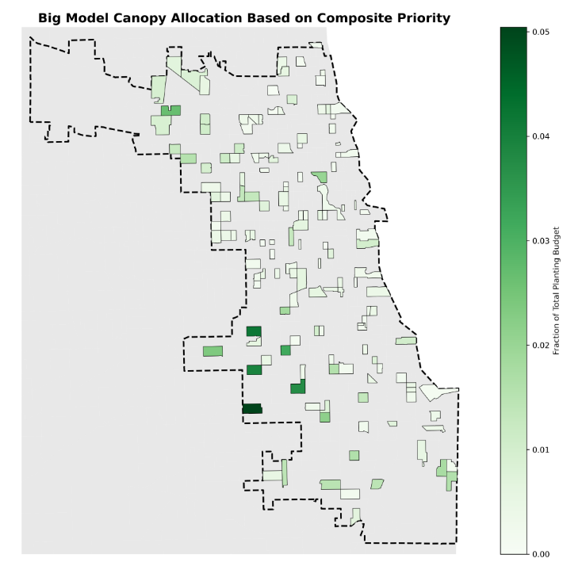

## Project Overview

This study developed a data-driven framework for allocating new tree canopy across Chicago to maximize public health benefits, mitigate urban heat, improve air quality, and address environmental inequities.

Using census-tract-level data, a Mixed-Integer Linear Programming (MILP) optimization framework identified priority tracts for tree planting. Models considered multiple objectives, including total population, low-income residents, air quality, Urban Heat Index (UHI), and social vulnerability to extreme heat.

Results show that strategic canopy allocation can target both high-density and hish-risk areas, benefiting over 1.8 million residents while maintaining ecological and equity constraints.

---

## Skills Demonstrated

- Urban planning and environmental equity analysis
- Geospatial data processing (TIGER/Line shapefiles, centroids, buffers)
- Mixed-Integer Linear Programming (MILP) optimization
- Multi-objective decision modeling
- Quantitative analysis of environmental exposure and social vulnerability
- Data visualization using GIS maps
- Policy-informed prioritization or urban forestry initiatives

---

## Methods (Key Details)

**Data Sources:**
Six census-tract-level datasets were used:

- Current tree canopy coverage
- Total population
- Low-income population
- Airborne pollutant concentrations
- Urban Heat Index (UHI)
- Social vulnerability to extreme heat

**Design:**
Five single-objective MILP models were run to prioritize tracts for planting based on:

1. Population
2. Low-income population
3. Air quality
4. Urban Heat Index
5. Social vulnerability

A final composite "Big Model" aggregated the single-objective results with weighted priorities to identify the highest-impact tracts for canopy investment.

**Geospatial Processing:**
- Census tract centroids were calculated for distance-based benefit propogation (1.5 km radius).
- Overlapping planting zones were restricted to prevent unrealistic density.
- Planting eligibility excluded tracts already exceeding 40% canopy coverage.

**Budget and Constraints:**
- Total available planting area: 8.93 km² (effective budget after practicality adjustments).
- Each tracts could not exceed 40% canopy post-planting.
- Budget fractions were allocated per tract according to optimization outcomes.

---

## Results

### Current Canopy Coverage
Maps revealed uneven tree canopy distribution, with several northern tracts already near or above 40% canopy coverage, limiting planting options.

### Population Model
52 tracts were selected to maximize benefits for the greatest number of residents, impacting over 1.86 million people. Allocated budget fractions ranged from 0.26% to 6.33% per tract. 

### Low-Income Population Model
50 tracts were prioritized to benefit low-income residents, reaching over 1.4 million people in vulnerable communities. Budget fractions ranged from 0.26% to 6.27%.  

### Air Quality Model
52 tracts were selected in areas with high airborne pollutant concentrations. Allocated budget fractions ranged from 0.26% to 6.33%, targeting neighborhoods with the greatest air-quality improvement potential.  

### Urban Heat Index Model
52 tracts were selected in areas with high summer heat exposure (UHI), prioritizing extreme-heat mitigation. Budget fractions ranged from 0.26% to 6.33%.  

### Social Vulnerability Model
55 tracts were selected where residents had multiple components of social vulnerability to extreme heat. Budget allocations ranged from 0.26% to 5.05% per tract.  

### Composite “Big Model”
The integrated model selected 149 tracts, balancing population, equity, environmental, and health priorities. Major allocations included:

- Tract 17031700301: 5.04% of budget (~0.451 km²)  
- Tract 17031570300: 4.18% of budget (~0.373 km²)  
- Tract 17031650301: 3.96% of budget (~0.353 km²)  

All budget allocations remained within the 40% canopy limit.

{#fig-change width=70%}

---

## Key Takeaways

- Strategic canopy allocation can simultaneously address population density, environmental exposure, and social vulnerability.  
- Optimization models provide a transparent, data-driven approach for urban forestry planning.  
- Equity-focused planting ensures historically underserved communities gain access to environmental and health benefits.  
- Composite weighting allows city planners to adjust priorities (population, equity, air quality, heat mitigation) without rerunning models.  

