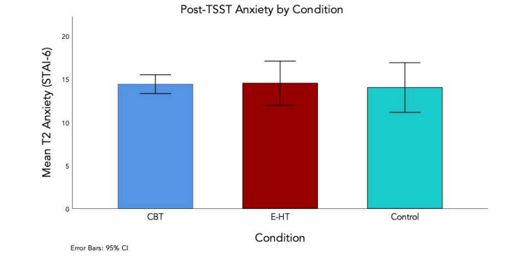
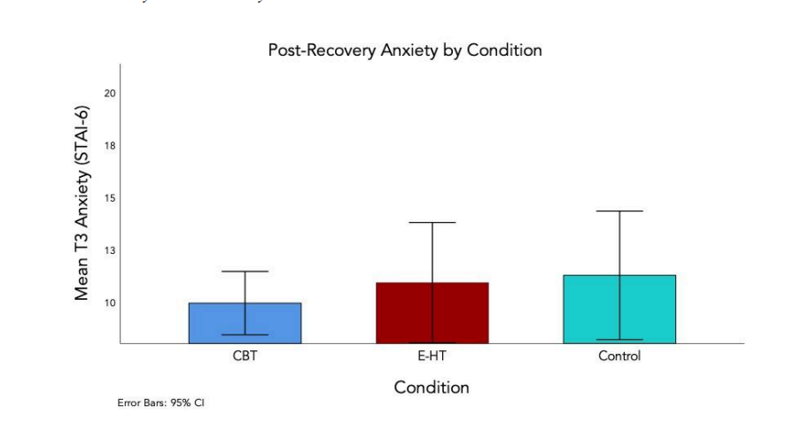

## Project Overview

This experimental study examined whether brief psychological interventions could reduce anxiety in college students following an acute social-evaluative stressor.

Participants completed a modified Trier Social Stress Test (TSST), a public speaking task designed to induce stress. Students were randomly assigned to one of three conditions:

- Cognitive-Behavioral Therapy (CBT) cognitive restructuring worksheet
- Existential meaning-making reflection worksheet
- Neutral writing control activity

State anxiety was measured at baseline, immediately after the speech task, and after a 30-minute recovery period using the STAI-6 scale.

Results from ANOVA analyses showed no statistically significant differences between conditions. Anxiety levels decreased during the recovery period for all participants, suggesting natural emotional regulation over time.

--- 

## Skills Demonstrated

- Experimental research design
- Random assignment and control conditions
- Psychological stress induction (TSST protocol)
- Quantitative analysis using SPSS
- One-way ANOVA statistical testing
- Psychological measurement using STAI-6
- APA-style scientific writing

--- 

## Methods (Key Details)

**Participants:**
36 undergraduate students at Denison University.

**Stress Induction:**
Modified TSST speech task (5-minute speech to neutral panelists).

**Design:**
Between-subjects experimental design with three conditions:

1. CBT cognitive restructuring
2. Existential meaning-making reflection
3. Neutral writing control

**Measures:**
State anxiety measured using the STAI-6 at three timepoints:

- Baseline
- Immediately post-TSST
- After 30-minute recovery

**Recovery Tasks:** 
30-minute sequence of neutral tasks including category listing, letter cancellation, and bead sorting.

---

## Results

### Descriptive Statistics
*Table: Descriptive Statistics for STAI-6 Scores*

| Timepoint     | Mean STAI-6 Score |
|---------------|-------------------|
| Baseline      | 13.11             |
| Post-TSST     | 14.29             |
| Post-Recovery | 10.66             |

### Post-TSST Anxiety

{#fig-post-tsst width=70%}

### Post-Recovery Anxiety

{#fig-post-recovery width=70%}

### Change in Anxiety During Recovery

## Key Takeaways

- Brief CBT and Existential worksheets did not significantly reduce acute anxiety following public speaking.
- Recovery occurred naturally across all groups, suggesting time and distraction can be effective.
- These findings highlight the importance of intervention timing and repetition for stress-management strategies in college students.

