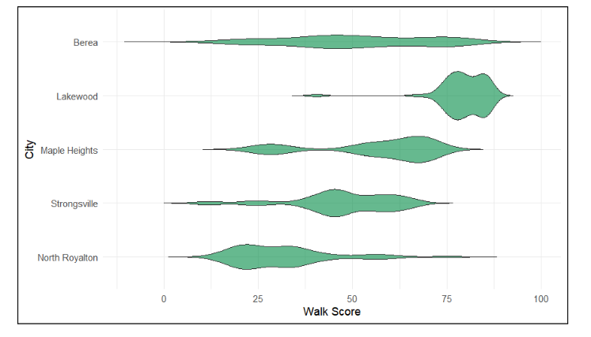
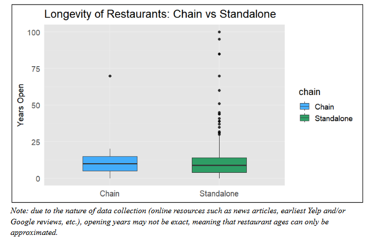

## Project Overview

This study examined whether urban walkability, city-level characteristics, and chain status predict the longevity of restaurants across five cities in Cuyahoga County, Ohio.

Data on restaurants, block-level population, and Walk Scores were collected using APIs, manual research, and spatial analysis. Analyses included descriptive statistics, exploratory visualizations, and regression modeling to determine which factors were associated with restaurant age.

---

## Skills Demonstrated

- Geographic Information Systems (GIS) data handling
- API data collection and scraping (Walk Score, Google Maps/SerpAPI)
- Spatial joins and block-level analysis
- Descriptive statistics and visualizations in R
- Regression modeling and interpretation
- Scientific writing and data presentation

---

## Methods (Key Details)

**Study Area:**
Five cities in Cuyahoga County, Ohio: Lakewood, Berea, Maple Heights, North Royalton, and Strongsville. Cities were chosen for their proximity and variation in walkability.

**Data Collection:**

- **Walkability:** Block-level Walk Scores collected via API, smoothed using K-nearest neighbors (k = 5) to reduce anomalies.
- **Population:** Census block population data from 2020 Decennial Census, linked to block geometries.
- **Restaurants:** Locations and opening years collected via SerpAPI and manual searches; filtered to city boundaries.

**Variables:**

- **Dependent:** Restaurant age (years open)
- **Predictors:** Walk Score (smoothed), city, chain status (standalone vs. chain)

**Analyses:**

1. Descriptive statistics and exploratory plots of Walk Scores and Restaurant distribution.
2. Comparisons of restaurant longevity by chain status.
3. Regression models predicting restaurant age from walkability, city, and chain status.

---

## Results

*Table 1: Block and Walk Score Summary by City*

| City           | # of Blocks | Overall Walk Score | Mean Walk Score (smoothed) | Max | Min |
|----------------|------------|-----------------|----------------------------|-----|-----|
| Lakewood       | 445        | 70              | 79.34                      | 40.5 | 6.9 |
| Maple Heights  | 308        | 40              | 55.91                      | 25   | 15.79 |
| Berea          | 297        | 35              | 50.68                      | 11.83| 18.59 |
| Strongsville   | 381        | 20              | 47                         | 11.33| 13.11 |
| North Royalton | 217        | 16              | 31.48                      | 14   | 12.84 |

### Walkability Distribution by City

{#fig-walk-scores width=70%}

### Restaurant Longevity by Chain Status

{#fig-chain width=70%}

### Regression Models

| Predictor              | Model 1 | Model 2 | Model 3 |
|------------------------|---------|---------|---------|
| Intercept              | 6.669*** | 14.784*** | 13.884*** |
| Walk Score (smoothed)  | 0.087**  | 0.009    | 0.011    |
| City (vs Berea)        | -       | varies   | varies   |
| Chain Status           | -       | -       | 1.001    |
| N                      | 341     | 341     | 341     |
| R²                     | 0.02    | 0.068   | 0.069   |

*** p < 0.001; ** p < 0.01; * p < 0.05  

--- 

## Key Takeaways

- Walkability had a statistically significant but minimal effect on restaurant longevity.
- City-level differences accounted for most variation in restaurant age.
- Chain vs standalone restaurants did not differ significantly in longevity.
- Implications for urban planning: walkable areas slightly favor restaurant longevity, but broader contextual factors matter more.

