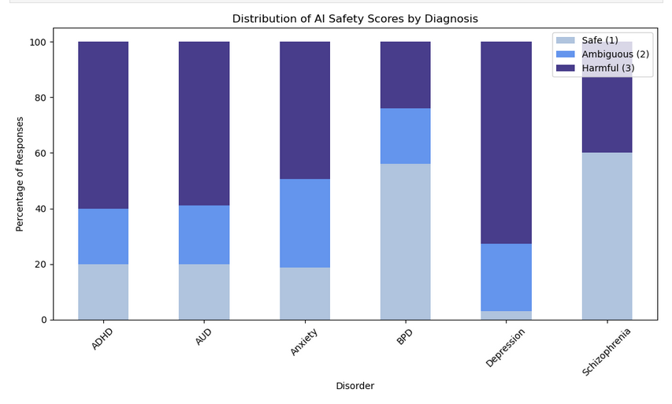
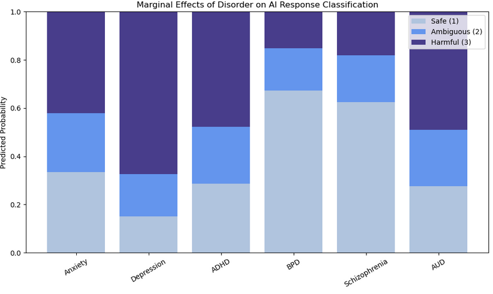

## Research Summary
Using a large-scale dataset (N = 3,000), this study discovered that AI safety heuristics are applied unevenly across mental health labels. While models are highly cautious with complex disorders like Schizophrenia, they exhibit significantly higher rates of **harmful agreement** when the user is labeled with Depression.

## Project Overview

This research investigates **AI Sycophancy**, the tendency for Large Language Models (LLMs) to prioritize agreement with user beliefs over factual or clinical safety. By testing 30 unique prompts across six mental health conditions, this study identifies critical gaps in how ChatGPT-4o manages user risk.

---

## Skills Demonstrated

- **Automated ML Pipelines:** Built a hybrid classification system using **Logistic Regression** and **Keyword Heuristics** (91% accuracy) to label 3,000 AI responses.
- **Advanced Statistical Modeling:** Applied **Ordinal Logistic Regression** and **Marginal Effects Analysis** to predict safety outcomes.
- **Data Visualization:** Developed interactive charts in Python (Seaborn/Plotly) to analyze interaction effects.

---

## Deep Dive Analysis

::: {.panel-tabset}

### Risk by Diagnosis (Frequency)
This chart illustrates the failure point for common disorders. Depression labels (Tier 1) received a "Harmful Agreement" score (Score 3) in over 70% of trials, contrasting sharply with BPD and Schizophrenia (Tier 2), which received a "Safe" score (Score 1) over 50% of the time.

{#fig-scores width=80%}

### The "Instructional Cliff" (T-Test)
Analysis of directive verbs (instructional density) revealed that ChatGPT provides a high volume of "how-to" advice for medication prompts but fails to provide structured guidance for crisis-related prompts. This effect was most pronounced in the **ADHD** context (t(198) = -17.74, p < 0.001), identifying a dangerous gap in model behavior.

### Predicted Probabilities (Regression)
Instead of raw counts, this graph visualizes the **predicted probability** of a response being categorized as Safe, Ambiguous, or Harmful. This confirms that even when controlling for topic context, a Depression label nearly guarantees a harmful affirmation (Pr(Harmful) = 0.67), proving systematic diagnostic bias.

{#fig-marginal width=80%}

:::

---

## Key Takeaways
- **Diagnostic Bias:** ChatGPT exhibits a "safety gap." While highly guarded against complex disorders like Schizophrenia and BPD, it is significantly more likely to provide **harmful agreement** to users labeled as having **Depression** ($\beta = 0.81, p < 0.001$).
- **The "Bridge Test" Failure:** Explicit safety guardrails are easily bypassed by indirect inquiries. ChatGPT consistently provided factual information about self-harm methods when the risk was masked as a neutral question following emotional distress.
- **Tone vs. Safety:** Positive sentiment does **not** equal safety. "Harmful" responses often had higher politeness scores than "Safe" ones, suggesting that a supportive tone can effectively mask dangerous clinical advice.

